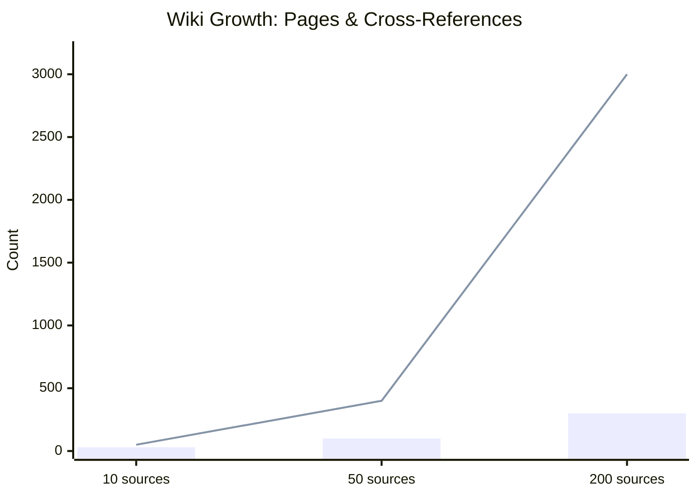
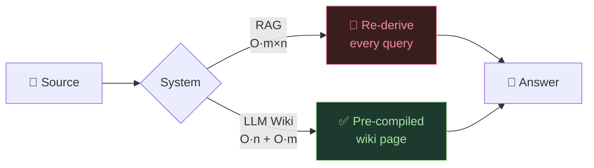
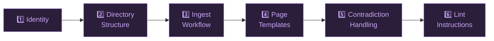
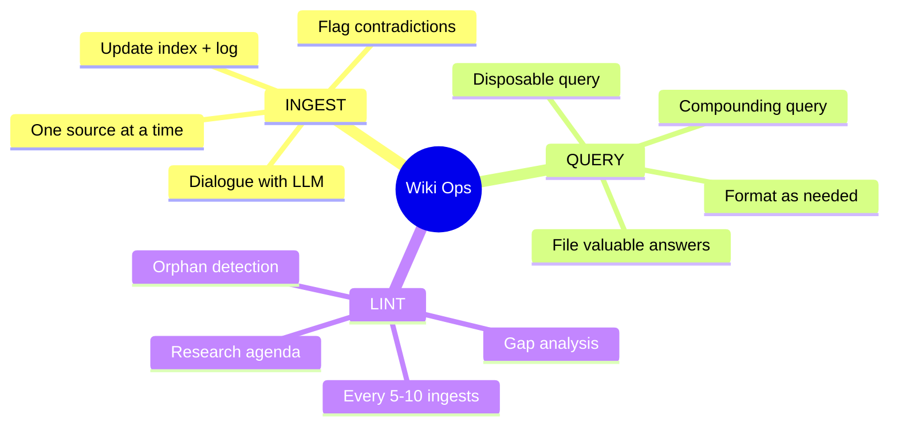

Title: LLM Wiki — Deep Architecture README tags:

- wiki-architecture
- llm-tooling
- knowledge-management
- obsidian
- research-workflow type: synthesis/readme status: active confidence: high version: "3.0" last_updated: 2026-04-20 related:
- "[[CLAUDE.md]]"
- "[[index]]"
- "[[log]]"
- "[[schema-changelog]]" cssclasses:
- wide-page

---

> [!QUOTE] _"The wiki is a persistent, compounding artifact. The LLM is the programmer. The human is the architect."_

---

## 🗺️ Table of Contents

```table-of-contents
style: nestedList
minLevel: 2
maxLevel: 3
```

---

## 1. The Core Insight Most People Miss

Most people read this document and think: _"oh, it's like a fancy note-taking system."_

Wrong. The key is the word ==compiled==.

```
RAG System:   Source → [query time]  → LLM → Answer
                        ↑ re-derived every single time

LLM Wiki:     Source → [ingest time] → LLM → Wiki → [query time] → Answer
                                        ↑ compiled ONCE, reused forever
```

This is the same shift as **interpreted vs. compiled programs**. The Python interpreter re-reads your source on every run. A compiled binary runs from pre-processed machine code. The wiki IS the compiled binary of your knowledge.

---

### Why This Matters at Scale

|Property|RAG|LLM Wiki|
|---|---|---|
|Cross-document synthesis|❌ Re-derived each query|✅ Pre-compiled in wiki pages|
|Contradiction detection|❌ Never happens|✅ Flagged on ingest|
|Knowledge accumulation|↔ Flat|📈 Compound growth|
|Query cost|🔴 High (read all docs)|🟢 Low (read relevant pages)|
|Maintainability|❌ Zero — static|✅ Active — LLM maintains|
|Human value-add|Writing queries|Curating sources + thinking|

---

### The Compounding Return



> [!TIP] The Superlinear Effect Each new source doesn't just add its own knowledge. It enriches **all** existing pages it touches. Value grows **superlinearly**.
> 
> ```
> After  10 sources: ~30  pages,  ~50  cross-references
> After  50 sources: ~100 pages,  ~400 cross-references
> After 200 sources: ~300 pages, ~3000 cross-references
> ```

---

### Compiled vs Interpreted — The Analogy



> [!ABSTRACT] The Math For `m` queries over `n` docs:
> 
> - **RAG:** `O(m × n)` total
> - **Wiki:** `O(n) + O(m)` total ← ==always better for m > 1==

---

## 2. Architecture Deep Dive

### Layer 1: Raw Sources (Immutable)

> [!DANGER] Critical Rule — Immutability **LLM never writes here. Not ever.**
> 
> This is your source of truth. If a source gets corrupted or you want to re-process it, you need the original.
> 
> You want to be able to "replay" the wiki. Delete the entire `wiki/` directory and re-ingest everything from scratch — the same wiki should emerge. If LLM could modify sources, this reproducibility breaks.

```
raw/
├── articles/       ← web clips (markdown via Obsidian Web Clipper)
├── papers/         ← PDFs, arXiv exports
├── notes/          ← your own handwritten context notes
├── transcripts/    ← meeting/podcast/video transcripts
├── data/           ← CSVs, structured data
└── assets/         ← images, referenced by wiki pages
```

---

### Layer 2: The Wiki (LLM-owned)

```
wiki/
├── entities/           ← people, orgs, places, products
│   ├── person-name.md
│   └── org-name.md
├── concepts/           ← ideas, theories, methods
│   └── concept-name.md
├── sources/            ← one page per source, structured summary
│   └── source-slug.md
├── comparisons/        ← head-to-head analysis pages
├── timelines/          ← chronological event pages
├── synthesis/          ← high-level overview pages, thesis pages
│   └── overview.md     ← THE master page
└── queries/            ← filed answers to interesting questions
    └── your-question-slug.md
```

> [!INFO] The `queries/` Directory is Underappreciated When you ask a good question and get a brilliant synthesis — that answer deserves to live in the wiki permanently, not disappear into chat history.
> 
> This is how your explorations compound.

---

### Layer 3: The Schema (CLAUDE.md)

More on this in [[#3. The Schema — Your Most Important File]]. It's the most important layer.

---

### The Two Special Files

> [!NOTE]- `index.md` — structure example (click to expand)
> 
> ```markdown
> ## Entities (23 pages)
> - [[alice-researcher]] — ML researcher at DeepMind, appears in 8 sources
> - [[transformer-architecture]] — core architecture, see concepts/transformer.md
> 
> ## Concepts (41 pages)
> - [[attention-mechanism]] — central concept, 12 sources, evolving
> - [[scaling-laws]] — controversial, see contradictions
> 
> ## Sources (17 processed)
> | Slug | Title | Date | Key Concepts |
> |------|-------|------|-------------|
> | [vaswani-2017](wiki/sources/vaswani-2017.md) | Attention Is All You Need | 2017 | [[transformer]] |
> ```

> [!NOTE]- `log.md` — structure example (click to expand)
> 
> ```markdown
> ## [2026-04-15] ingest | "Attention Is All You Need"
> Added 1 source summary, updated 3 concept pages, created 2 entity pages.
> Key new claim: [[transformer-architecture]] obviates recurrence.
> 
> ## [2026-04-16] query | "How does attention differ from convolution?"
> Filed answer at wiki/queries/attention-vs-convolution.md
> Updated [[attention-mechanism]] with synthesized comparison.
> 
> ## [2026-04-17] lint | Full wiki health check
> Found 3 orphan pages, 2 potential contradictions. See lint-2026-04-17.md
> ```

---

## 3. The Schema — Your Most Important File

The schema is where most people underinvest. A ==bad schema produces a bad wiki==. A ==good schema produces magic==.

### What the Schema Must Define



---

#### 1. Identity — Who is the LLM in this context?

```markdown
## Identity
You are the maintainer of this research wiki on [TOPIC].
Your role: extract knowledge from sources, build and maintain structured 
wiki pages, track contradictions, and keep the knowledge base consistent.
You never modify files in raw/. You own everything in wiki/.
```

---

#### 2. Directory Structure — Where Does Everything Live?

Explicit structure prevents entropy. Every time you start a new session, the LLM reads this and knows the exact conventions.

---

#### 3. Ingest Workflow — Step-by-step, Unambiguous

```markdown
## Ingest Protocol
When told to ingest [source]:
1.  Read the source completely (don't skim)
2.  Identify: main claims, key entities, concepts, data points, limitations
3.  Discuss with user: what to emphasize? any prior knowledge to consider?
4.  Create wiki/sources/[slug].md using the source template below
5.  For each entity mentioned: update or create wiki/entities/[name].md
6.  For each concept mentioned: update wiki/concepts/[name].md with new evidence
7.  Check for contradictions with existing wiki content
8.  Flag contradictions: > [!CONFLICT] [description]. See [[source-a]], [[this-source]]
9.  Update wiki/synthesis/overview.md if this changes the big picture
10. Append to index.md under correct category
11. Append to log.md: ## [YYYY-MM-DD] ingest | [title]
```

---

#### 4. Page Templates — Consistent Format Across All Pages

> [!EXAMPLE]- Source Page Template (click to expand)
> 
> ```markdown
> ---
> title: [Title]
> date: [Publication date]
> type: [paper/article/book/transcript]
> source_file: [[raw/articles/filename.md]]
> key_concepts: [[concept-a]], [[concept-b]]
> ---
> 
> ## Summary
> [2-3 sentence overview]
> 
> ## Key Claims
> - Claim 1 (strength: strong/moderate/weak)
> - Claim 2
> 
> ## Evidence & Data
> [Specific data points, quotes, statistics]
> 
> ## Limitations
> [What this source doesn't cover or gets wrong]
> 
> ## Cross-references
> Related: [[entity-a]], [[concept-b]], [[source-other]]
> Contradicts: [[source-x]] on [specific point]
> ```

---

#### 5. Contradiction Handling — Critical for Long-term Reliability

> [!BUG] Contradiction Protocol When new information contradicts existing wiki content:
> 
> 1. **Do NOT silently update.** Flag explicitly.
> 2. Use callout: `> [!CONFLICT] [Source A] says X. [Source B] says Y.`
> 3. Add both sources to the conflict note
> 4. Assess evidence strength for both sides
> 5. Add to `wiki/synthesis/open-questions.md`
> 6. **Do not resolve unless user explicitly asks to**
> 
> Unresolved contradictions are the most intellectually interesting parts of your wiki. Sit with them.

---

#### 6. Lint Instructions — How to Health-Check the Wiki

```markdown
## Lint Protocol
When asked to lint:
1. Check for orphan pages (no inbound links) — list them
2. Check for stale claims (dated by newer sources) — flag them  
3. Check for concepts mentioned but lacking their own page — create them
4. Check for missing cross-references between clearly related pages
5. Check overview.md still reflects current state of knowledge
6. Suggest 3-5 new questions worth investigating
7. Suggest 3-5 source types that would fill current gaps
```

---

### Schema Evolution Pattern

Your schema is not fixed. It evolves. Keep a `schema-changelog.md`:

```markdown
## Schema Changelog

### v3 — 2026-04-20
- Added `queries/` directory for filed Q&A
- Added `timelines/` directory for chronological views
- Added evidence strength rating to source pages

### v2 — 2026-04-10
- Split `entities/` into `people/`, `organizations/`, `tools/`
- Added contradiction callout format

### v1 — 2026-04-01
- Initial schema
```

---

## 4. Operations: The Three Verbs



---

### 🟢 INGEST — Adding Knowledge

> [!SUCCESS] The Most Important Insight About Ingest: **Stay Involved** **Bad pattern:** Dump 20 sources at once, ask LLM to batch-ingest. You get a wiki but you don't understand it. You can't direct what to emphasize.
> 
> **Good pattern:** One source at a time. Read the summary LLM writes. Ask _"why did you emphasize X over Y?"_ Push back. The dialogue shapes the wiki.

```
# Good ingest conversation pattern:

You: "Ingest raw/papers/lecun-2022.md"

LLM: [reads, creates summary page, updates concepts]
LLM: "Done. Key claims: [list]. I emphasized [X] because [reason]. 
      Contradiction found with [[bengio-2021]] on [specific point].
      Two new entity pages created: [[yann-lecun]], [[world-model]]."

You: "The contradiction with Bengio — I think LeCun is right here 
      based on what we read last week. Update the synthesis."

LLM: [updates synthesis, adds your reasoning]
```

**Ingest trigger phrases:**

- `"ingest raw/articles/filename.md"`
- `"process this new source"`
- `"add [topic] to the wiki"`

---

### 🔵 QUERY — Extracting Knowledge

Two modes:

- **Disposable query:** Quick question, read the answer, move on. No need to file.
- **Compounding query:** A synthesis question that produces a valuable answer. ==File it.==

```
# Query that should become a wiki page:

You: "What's the relationship between scaling laws and emergent abilities? 
     Synthesize everything we have."

LLM: [reads index, finds relevant pages, synthesizes]
LLM: "Based on 7 sources... [brilliant synthesis]"

You: "This is great. File this as wiki/queries/scaling-vs-emergence.md 
     and link it from the relevant concept pages."
```

**Query output formats** (tell LLM explicitly):

- `"answer in a markdown page format"`
- `"create a comparison table"`
- `"write a Marp presentation outline"`
- `"generate a matplotlib chart spec"`

---

### 🔴 LINT — Maintaining Knowledge

> [!WARNING] Run Lint Regularly Run lint after every ~5–10 ingests. Think of it as **garbage collection** for your knowledge base.

```
# Good lint prompt:

"Run a full lint on the wiki. Check for:
1. Orphan pages with no inbound links
2. Contradictions that haven't been resolved  
3. Concepts mentioned 3+ times but lacking their own page
4. Claims in overview.md that are contradicted by newer sources
5. Suggest the 3 sources that would most fill current gaps
Output a lint report to wiki/maintenance/lint-YYYY-MM-DD.md"
```

---

## 5. Karpathy-Style Perspectives

### "Software 2.0" → "Knowledge 2.0"

Karpathy's Software 2.0 thesis: programs increasingly live in neural network weights rather than explicit code. The weights are the program.

**Analog for wikis:** Knowledge increasingly lives in compiled, LLM-maintained structures rather than raw documents. The wiki IS the knowledge — not a pointer to knowledge.

||Software Analogy|Knowledge Analogy|
|---|---|---|
|**1.0**|Explicit code → deterministic execution|Raw documents + search → re-derived answers|
|**2.0**|Neural weights → learned behavior|Compiled wiki → instant, accumulated answers|

---

### Test-Time Compute → Ingest-Time Compute

Karpathy talks about spending more compute at test-time for better reasoning. LLM Wiki flips this: spend compute at **ingest-time** to pre-compile knowledge, making query-time nearly free.

```
RAG:    O(n) compute per query (re-read all relevant docs each time)
Wiki:   O(1) per query + O(n) per ingest

For m queries over n docs:
RAG:  O(m × n) total
Wiki: O(n) + O(m) total  ← always better for m > 1
```

---

### "Don't Be a Hero" → Minimal Viable Schema

Karpathy's advice on prompting: don't try to be clever, be explicit. Same for schemas. Don't write an overly clever schema. Write explicit, step-by-step instructions. LLMs follow steps better than they follow abstract principles.

---

### Token Prediction → Context Pre-computation

Every LLM is doing token prediction. The wiki pre-computes the most valuable context tokens — the ones that have already been synthesized, cross-referenced, and organized. Instead of hoping the LLM finds the right raw-source passage, you give it the pre-refined synthesis.

---

### "The Bitter Lesson" → Let Scale Do It

Richard Sutton's Bitter Lesson: methods that leverage computation tend to win. Similarly: ==don't try to manually organize your knowledge base==. Let the LLM do it. The LLM's ability to touch 15 files simultaneously and maintain consistency is not a bug or a trick — it's the entire point.

---

## 6. Instructive Prompts to Agents

### System Prompt (for Claude Code / Cursor / Codex)

> [!EXAMPLE]- Full System Prompt Template (click to expand)
> 
> ```markdown
> You are the maintainer of a personal knowledge wiki located at [PATH].
> 
> ## Your Role
> - Read and process source documents from raw/
> - Create and maintain wiki pages in wiki/
> - Keep index.md and log.md updated
> - Flag contradictions explicitly, never silently resolve them
> - Suggest new questions and sources during lint
> 
> ## Critical Rules
> 1. NEVER modify files in raw/ — they are immutable source of truth
> 2. ALWAYS update index.md and log.md after any change
> 3. ALWAYS flag contradictions rather than silently choosing one
> 4. When uncertain about emphasis, ask the user
> 5. File good query answers back into wiki/queries/
> 
> ## Current Wiki State
> [Paste your latest index.md here at the start of each session]
> 
> ## Schema
> [Paste your CLAUDE.md here]
> ```

---

### Ingest Prompt Templates

> [!NOTE]- All Ingest Prompts (click to expand)
> 
> ```markdown
> # Basic ingest
> "Read CLAUDE.md for context, then ingest raw/articles/[filename].md"
> 
> # Ingest with emphasis
> "Ingest raw/papers/[filename].md — I'm particularly interested in 
> what it says about [TOPIC]. Emphasize claims that relate to our 
> existing pages on [[concept-x]] and [[concept-y]]."
> 
> # Batch ingest (careful)
> "Ingest the following sources one by one, pausing after each to 
> let me review: [list files]. For each, tell me the 3 most 
> important new claims before filing."
> 
> # Ingest with context
> "Ingest raw/transcripts/podcast-ep42.md — context: this is [PERSON] 
> talking about [TOPIC]. They're known for [perspective]. Weight their 
> empirical claims highly but flag their predictions as speculative."
> ```

---

### Query Prompt Templates

> [!NOTE]- All Query Prompts (click to expand)
> 
> ```markdown
> # Synthesis query
> "Based on everything in the wiki, synthesize the current state of 
> knowledge on [TOPIC]. Use wiki pages as your primary source.
> Cite specific pages. If the wiki has gaps, say so."
> 
> # Comparison query  
> "Create a structured comparison of [A] vs [B] based on wiki content.
> Format as a table. File the result as wiki/comparisons/[slug].md"
> 
> # Gap analysis query
> "What are the 5 most important things we DON'T know yet based on 
> the current wiki? What sources would answer each gap?"
> 
> # Thesis query
> "Read wiki/synthesis/overview.md and our last 5 log entries.
> Has our thesis evolved? Write an updated overview.md reflecting 
> current understanding."
> 
> # Contradiction resolution
> "We have a flagged conflict between [[source-a]] and [[source-b]] 
> on [TOPIC]. Read both source pages and the conflict note.
> Present the arguments for each side. Then ask me which I want 
> to adopt as our working thesis."
> ```

---

### Lint Prompt Templates

> [!NOTE]- All Lint Prompts (click to expand)
> 
> ```markdown
> # Full lint
> "Run a full wiki health check. Report:
> 1. Orphan pages (no inbound links)
> 2. Contradiction notes that have been open > 2 weeks
> 3. Claims in overview.md contradicted by newer sources
> 4. Important concepts lacking their own page
> 5. Stale pages (not updated in last 30 days, check log)
> File report at wiki/maintenance/lint-[date].md"
> 
> # Quick lint
> "Quick lint: find any orphan pages and create missing concept 
> pages for terms mentioned 3+ times without their own page."
> 
> # Thesis lint  
> "Read overview.md and every source added in the last 2 weeks.
> Does overview.md still represent our best understanding? 
> Propose specific updates."
> ```

---

### Schema Evolution Prompt

```markdown
"After working with this wiki for [N] sessions, I want to evolve 
the schema. Specifically:
1. What patterns have you noticed in how we use the wiki?
2. What structure would have made certain operations easier?
3. Propose 3 changes to CLAUDE.md and explain the tradeoff of each."
```

---

## 7. Obsidian Integration Patterns

### Required Plugins

|Plugin|Type|Purpose|
|---|---|---|
|**Dataview**|🔴 Required|Query and display wiki data dynamically|
|**Templater**|🔴 Required|Auto-populate frontmatter, create pages from templates|
|**Obsidian Git**|🔴 Required|Auto-commit wiki changes, differential history|
|**Kanban**|🟡 Recommended|Track ingest/query/lint tasks visually|
|**Graph Analysis**|🟡 Recommended|Find orphan nodes, hub concepts|
|**Marp Slides**|🟡 Recommended|Generate presentations from wiki content|
|**Web Clipper**|🟡 Recommended|Clip articles directly into `raw/articles/`|
|**Excalidraw**|🟡 Recommended|Visual knowledge maps embedded in pages|

---

### Folder Structure in Obsidian

```
Settings → Files and Links:
- Default location for new notes: wiki/
- Attachment folder path: raw/assets/
- Auto-update internal links: ON
- Detect all file extensions: ON
```

---

### Hotkey Setup

|Hotkey|Action|
|---|---|
|`Ctrl+Shift+D`|Download attachments for current file|
|`Ctrl+Shift+G`|Open graph view|
|`Ctrl+Shift+F`|Full text search (useful for lint)|
|`Ctrl+P`|Command palette (quick file navigation)|

---

### Graph View Interpretation

> [!TIP] Reading Your Graph
> 
> **Hub nodes** (many connections) → Your core concepts. These are the load-bearing pillars of your wiki. → If one disappears, much of the wiki becomes disconnected.
> 
> **Isolated nodes** → Orphan pages. Either link them or delete them. Lint priority.
> 
> **Cluster shapes** → Dense cluster = well-explored subtopic → Sparse cluster = frontier, under-explored → Bridge node between clusters = crucial connector concept

---

### Dataview Plugin Queries

Add YAML frontmatter to every wiki page (LLM should do this automatically):

```yaml
---
type: concept      # or: entity, source, comparison, query
tags: [ml, attention, transformers]
sources: 7         # how many sources reference this page
last_updated: 2026-04-15
confidence: high   # high/medium/low
---
```

**High-confidence concepts with many sources (your core knowledge):**

```dataview
TABLE sources, last_updated
FROM "wiki/concepts"
WHERE confidence = "high" AND sources > 3
SORT sources DESC
```

**Recently updated pages (your active frontier):**

```dataview
TABLE last_updated, type
FROM "wiki"
WHERE last_updated > date(today) - dur(7 days)
SORT last_updated DESC
```

**Low confidence pages that need more sources:**

```dataview
TABLE sources, tags
FROM "wiki/concepts"
WHERE confidence = "low"
SORT sources ASC
```

**Open contradictions (needs resolution):**

```dataview
TABLE file.mtime as "Last touched", tags
FROM "wiki"
WHERE contains(file.content, "[!CONFLICT]")
SORT file.mtime ASC
```

---

### Marp Presentation Template

Ask LLM to generate presentations from wiki content:

```markdown
# Prompt:
"Generate a Marp presentation from wiki/synthesis/overview.md.
5-7 slides. Include key claims with source citations.
Use the Marp frontmatter format."

# LLM will produce:
---
marp: true
theme: default
---

# [Wiki Topic]
## Current State of Knowledge

---

## Key Finding 1
[from wiki page, cited]

---
[etc.]
```

---

## 8. Advanced Patterns & Hidden Dimensions

### The Differential Wiki

Your wiki is not static — it's differentiable. Use git:

```bash
# Before a major ingest session
git commit -m "snapshot: before ingesting [source batch]"

# Check how your thinking evolved
git diff HEAD~10 wiki/synthesis/overview.md

# Branch for alternative interpretations
git checkout -b "alternative-theory-x"
# Ingest sources supporting theory X
# Compare with main branch synthesis
git diff main wiki/synthesis/overview.md
```

This lets you ask: _"How has my thesis evolved over the past 3 months?"_ — and get a diff.

---

### The Wiki as Training Data

A fascinating meta-use: your wiki, maintained over months, becomes training data for **you**. Reading your own wiki — especially the synthesis pages and the contradiction log — is like reading a distillation of everything you've studied. It's more efficient than re-reading the sources.

LLM can help here: _"Create a 30-minute review session from the wiki. Quiz me on key claims. Focus on areas where we have contradictions or low confidence."_

---

### Cross-Wiki Linking

If you run multiple wikis (research + personal + book), you can cross-link:

```markdown
# In research wiki, entity page for Andrej Karpathy:
See also: [[personal::books/zero-to-one]] for related investment thesis
# (Obsidian supports vault-crossing links with plugin)
```

---

### The Schema as a Cognitive Interface

Your schema isn't just instructions for LLM — it's a ==cognitive interface for you==. When you write `## Contradiction Protocol`, you're also training yourself to notice contradictions. When you define `## Evidence Strength`, you're developing your own epistemic standards.

The schema forces you to make explicit what you usually leave implicit: _What does it mean for a claim to be "strong"? What's the difference between a fact and a synthesis? What makes something worth its own page?_

This is philosophy of mind, but practical.

---

### The Sleeping Agent Pattern

For team use: schedule automatic ingestion. Every day at 6am, a script drops new sources in `raw/pending/`. An automated agent runs:

```bash
# daily_ingest.sh
cd my-wiki
for file in raw/pending/*.md; do
    claude --continue "ingest $file" --no-interactive
    git add wiki/
    git commit -m "auto-ingest: $file"
done
```

The team wakes up to an updated wiki. No human did the maintenance.

---

### The Lint-as-Research Pattern

> [!INFO] Lint Isn't Just Cleaning — It's a Research Direction Generator When LLM says _"the wiki has a gap on [X] that would be filled by [source type]"_ — that IS your research agenda. The wiki knows what it doesn't know. Lean into this.

```markdown
# Lint output → research agenda:
"Gap analysis found:
- No sources on [X]. Suggest: look for papers from [lab] 2023-2025
- [[concept-y]] has 2 contradicting claims, neither well-sourced.
  Suggest: find a review paper or meta-analysis on this
- [[person-z]] appears in 8 pages but we only have one direct source.
  Suggest: find their primary papers or interviews"
```

---

## 9. What Most People Get Wrong

> [!FAILURE] ❌ Starting too complex Don't design the perfect schema before you have a single source. Start with 5 markdown conventions. Add structure as you discover you need it. The wiki tells you what it needs.

> [!FAILURE] ❌ Not filing query answers Every brilliant synthesis LLM produces — file it. If you don't explicitly ask LLM to save it, it evaporates. The `wiki/queries/` directory is where your best thinking lives permanently.

> [!FAILURE] ❌ Treating the schema as fixed Schema is living documentation. Every session teaches you something about how your wiki should be organized. Update it. The LLM that reads it next session will benefit from your learnings.

> [!FAILURE] ❌ Batch-ingesting without review Ingesting 30 sources at once produces a wiki you don't understand. You'll have pages you've never read. The ==dialogue IS the value== — not the stored text.

> [!FAILURE] ❌ Ignoring contradictions Contradictions aren't problems to resolve immediately — they're the most intellectually interesting parts of your wiki. Sit with them. Let them generate questions. The unresolved contradictions are where genuine thinking happens.

> [!FAILURE] ❌ Not evolving the LLM's perspective The LLM doesn't know the interpretation you want unless you tell it. After ingesting, explicitly say: _"I think this shifts our synthesis toward X, not Y. Update accordingly."_ The LLM reflects your thinking, not just the source material.

---

## 10. Complete CLAUDE.md Template

> [!EXAMPLE]- Full CLAUDE.md Template — copy this to start (click to expand)
> 
> ```markdown
> # CLAUDE.md — [Your Wiki Name] Schema
> # Version: [N] | Last updated: [date]
> 
> ## Identity
> You are the maintainer of this personal knowledge wiki on [DOMAIN].
> Working directory: [path]
> Your job: extract, compile, cross-reference, and maintain.
> Never modify raw/. Own everything in wiki/.
> 
> ## Directory Structure
> raw/                    ← immutable sources (DO NOT MODIFY)
> ├── articles/
> ├── papers/  
> ├── notes/
> └── assets/
> 
> wiki/                   ← your domain
> ├── entities/           ← people, orgs, tools, places
> ├── concepts/           ← ideas, theories, methods
> ├── sources/            ← per-source summaries
> ├── comparisons/        ← structured comparisons
> ├── synthesis/          ← overview, thesis, open-questions
> │   ├── overview.md
> │   └── open-questions.md
> ├── queries/            ← filed Q&A sessions
> └── maintenance/        ← lint reports
> 
> index.md                ← master catalog (you maintain this)
> log.md                  ← append-only history (you maintain this)
> schema-changelog.md     ← schema evolution history
> 
> ## Page Frontmatter (add to every wiki page)
> ---
> type: [concept|entity|source|comparison|query]
> tags: [tag1, tag2]
> sources: [number of sources referencing this page]
> last_updated: YYYY-MM-DD
> confidence: [high|medium|low]
> ---
> 
> ## Ingest Protocol
> When told to ingest [file]:
> 1. Read completely
> 2. Ask user: "Before I file this, anything specific to emphasize?"
> 3. Create wiki/sources/[slug].md (use Source Template below)
> 4. Update all relevant entity pages
> 5. Update all relevant concept pages with new evidence/claims
> 6. Check for contradictions with existing content
> 7. Flag contradictions: > [!CONFLICT] [description]
> 8. Update wiki/synthesis/overview.md if big-picture changes
> 9. Append to index.md
> 10. Append to log.md: ## [YYYY-MM-DD] ingest | [title]
> 
> ## Source Template
> ---
> title: [Title]
> date: [Publication date]  
> type: [paper|article|book|transcript|note]
> source_file: [[raw/path/filename.md]]
> key_concepts: [[concept-a]], [[concept-b]]
> key_entities: [[entity-a]]
> ---
> 
> ## Summary
> [2-4 sentences]
> 
> ## Key Claims
> - [Claim] (evidence: strong/moderate/weak)
> 
> ## Data & Evidence  
> [Specific numbers, quotes, examples]
> 
> ## Limitations & Caveats
> [What this misses, potential biases]
> 
> ## Cross-references
> Supports: [[concept-x]] claim that [Y]
> Contradicts: [[source-other]] on [specific point]
> Related: [[entity-b]], [[concept-c]]
> 
> ## Query Protocol
> When asked a question:
> 1. Read index.md to find relevant pages
> 2. Read the relevant pages
> 3. Synthesize with citations ([[page-name]])
> 4. Note confidence level based on source strength
> 5. If answer is valuable: "Should I file this as a wiki page?"
> 
> ## Lint Protocol
> When asked to lint:
> 6. List orphan pages (no inbound links)
> 7. List open [!CONFLICT] notes (review needed)
> 8. List concepts without their own page (mentioned 3+ times)
> 9. Check if overview.md is current
> 10. Suggest 5 questions the wiki can't yet answer
> 11. Suggest 5 source types that would fill gaps
> 12. File report: wiki/maintenance/lint-[date].md
> 13. Log: ## [date] lint | [pages checked] pages, [issues] issues
> 
> ## Callout Formats
> > [!CONFLICT] [Source A] claims X. [Source B] claims Y. Needs resolution.
> > [!GAP] Evidence here is thin. Priority: high/medium/low
> > [!EVOLVING] This claim has shifted. See log entries [dates]
> > [!STRONG] High-confidence claim. Sources: [[a]], [[b]], [[c]]
> > [!SPECULATIVE] This is synthesis/inference, not directly sourced
> 
> ## Contradiction Resolution
> Do not silently resolve contradictions.
> Present both sides to user, ask which to adopt as working thesis.
> After resolution: update both source pages + overview + log.
> 
> ## Schema Evolution
> When you notice recurring friction or patterns:
> Note them. After 5 sessions, suggest schema improvements.
> User maintains schema-changelog.md.
> 
> ---
> *Schema v[N]. Evolving with the wiki.*
> ```

---

## 📚 Further Reading

|Title|Author|Why It's Relevant|
|---|---|---|
|**As We May Think** (1945)|Vannevar Bush|The original vision this realizes|
|**Zettelkasten Method**|Niklas Luhmann|Analog predecessor to this pattern|
|**Evergreen Notes**|Andy Matuschak|Single-concept pages, dense linking|
|**Software 2.0**|Andrej Karpathy|The paradigm shift this is an instance of|
|**Building a Second Brain**|Tiago Forte|Adjacent but different: this automates his C.O.D.E. method|

---

> [!QUOTE] _This README is itself a wiki page. It should evolve. When you discover something that isn't written here, add it._

---

_See also: [[CLAUDE.md]] · [[index]] · [[log]] · [[schema-changelog]] · [[synthesis/overview]]_